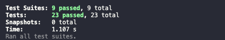
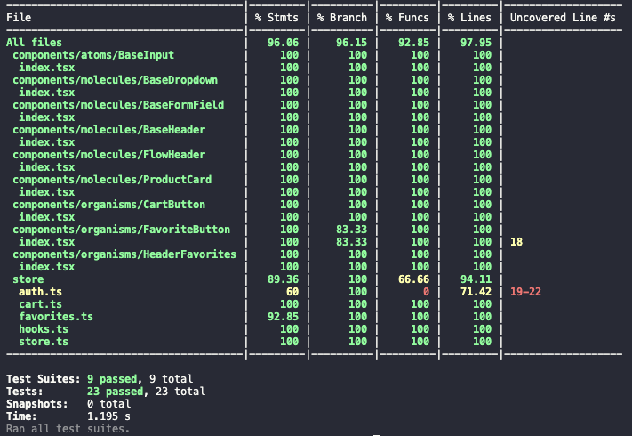
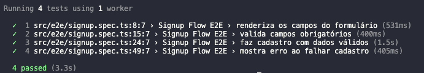

# 🧪 E-Commerce - React (NextJS) + TypeScript


Este é um projeto que consome a api `Fake Store API` para um ecommerce ficticio.

---

## 📦 Requisitos

- **Node.js** (v18 ou superior)
- **Yarn**

## 🔧 Tecnologias usadas

- [Node.js v18+](https://nodejs.org/)
- [TypeScript](https://www.typescriptlang.org/)
- [Next.js 15](https://nextjs.org/) – Framework React completo para produção, com suporte a renderização híbrida, rotas automáticas e otimizações de performance.
- [React 19](https://reactjs.org/) – Biblioteca JavaScript para construir interfaces de usuário com componentes reutilizáveis.
- [Tailwind CSS](https://tailwindcss.com/) – Framework de CSS utilitário que permite criar interfaces responsivas de forma rápida e sem sair do HTML.
- [Axios](https://axios-http.com/) – Cliente HTTP baseado em Promises para fazer requisições ao backend com facilidade.
- [React Hook Form](https://react-hook-form.com/) – Biblioteca de formulários para React que fornece uma maneira simples e eficiente de lidar com inputs, validações e estados.
- [Fake Store API](https://api.escuelajs.co/docs) - API para consumo do frontend “e-commerce style” (produtos, categorias, usuários…).

---

## 🛒 Porque escolhi o `NextJS`?

Para o desenvolvimento deste e-commerce, optei por utilizar o Next.js por ser um framework React moderno, robusto e altamente otimizado para aplicações web com foco em performance, SEO e escalabilidade. Escolhi a versao 13, a mais recente atualmente. o App/Pages Router (Next) nao existe mais nessa versao e optei justamente pelo API que ela possui para fazer um BFF (Back For Front) pra consumir a api principal.

### Vantagens do Next.js aplicadas ao projeto:

| Motivo | Explicação |
|--|--|
| ***Server-Side Rendering (SSR)*** | Permitem que as páginas sejam renderizadas no servidor ou geradas estaticamente, melhorando o tempo de carregamento, a experiência do usuário e o rankeamento nos buscadores (SEO). |
| ***Roteamento*** | Com o sistema de arquivos como base para rotas, é simples criar páginas como /produtos/[id], facilitando a criação de páginas dinâmicas para os produtos. |
| ***Otimização de imagens e performance nativa*** |  O Next.js oferece ferramentas internas para otimização de imagens, pré-carregamento inteligente de recursos e lazy loading, essenciais para um e-commerce rápido e responsivo. |
| ***SEO-friendly*** | A possibilidade de renderizar conteúdo no servidor garante que os produtos e categorias sejam indexáveis por mecanismos de busca, aumentando a visibilidade da loja. |
| ***Suporte robusto para autenticação e middlewares*** | Ideal para áreas como carrinho, checkout e dashboard do cliente, que exigem controle de acesso e proteção de rotas. |
| ***Pronto para deploy*** | Com suporte nativo a deploy na Vercel, integração com CDNs, cache inteligente e API Routes para lidar com back-end leve, o Next.js se torna uma escolha completa para projetos que vão para o ar. |

## 🚀 Como rodar o projeto

### 1. Clone o repositório

```bash
git clone https://github.com/dehcanuto/react-typescript-aiva
cd react-typescript-aiva
```

### 2. Instale as dependências

```bash
yarn install
```

### 3. Variáveis de ambiente

Preferi deixar o `.env` livre no repositório para encurtar os passos para rodar o projeto =D

---

## 🔥 Rode a aplicação

### Compila e usa Hot-Reload para ambiente de desenvolvimento

```sh
yarn dev
```

O projeto será apresentado através do link [http://localhost:3000](http://localhost:3000).

E no Vercel voce poderá visualizar através deste link através do link [https://react-typescript-aiva.vercel.app/](https://react-typescript-aiva.vercel.app/).

# 🧹 Rodando o Lint

Para manter a qualidade do código e seguir boas práticas, este projeto utiliza o ESLint com regras específicas para TypeScript e React.

### Como rodar o lint

Para verificar se há erros de lint no código, execute:

```bash
yarn lint
```

### Como corrigir erros automaticamente

Alguns erros podem ser corrigidos automaticamente com:

```bash
yarn lint --fix
```

### Identar o código

Caso queira identar automáticamente, utilize este comando:

```bash
yarn format
```

---

# 🧪 Rodando os Testes

Para garantir que tudo está funcionando corretamente, siga estes passos para rodar os testes do projeto:

## 1. Execute os testes
Para rodar todos os testes com Jest + Testing Library:

```bash
yarn test
```

Resultado dos testes:



## 2. Rodando os testes em modo watch (assistir alterações)

Para rodar os testes continuamente enquanto desenvolve:

```bash
yarn test --watch
```

## 3. Cobertura de testes

Para rodar a cobertura de testes, basta executar esse comando no terminal:

```bash
yarn test:coverage
```

Resultado de cobertura de testes:



## 4. Playwright

Para rodar o E2E execute este comando:

```bash
yarn e2e
```

Resultado do e2e:



## Deploy

Escolhi o Vercel pois já tinha conta e seria mais fácil de fazer.

Voce pode acessar diretamente [aqui](https://react-typescript-aiva.vercel.app/)
ou copiar o link no seu navegador: `https://react-typescript-aiva.vercel.app/`


---

## ✅ To-do

- [x] Fluxo de autenticação caso a API suporte (login, registro ou uso de token).
- [x] Dashboard principal com listagem, busca e/ou filtros relevantes.
- [x] Operações de CRUD (criar, editar, remover) para pelo menos um recurso-chave.
- [x] Página de detalhe para um item individual.
- [x] Responsividade e feedback visual (loading, estados vazios, erros).

**EXTRAS**

- [x] Code splitting & lazy loading  
- [x] Web Vitals e otimização de imagens  
- [x] Design System/componentes reutilizáveis
- [x] Documentação clara no **README.md**
- [x] CI GitHub Actions (lint, build, testes)

**Stack (mínimo obrigatório)**

| Feito | Item | Requisito |
|-|------|-----------|
|✅| **Linguagem** | TypeScript |
|✅| **Framework/Bundler** | **Next.js** |
|✅| **UI** | Tailwind |
|✅| **Estado/Dados** | Redux Toolkit |
|✅| **Roteamento** | App/Pages Router (Next) |
|✅| **Testes** | Jest + Testing Library **e** pelo menos 1 E2E (Cypress/Playwright) |
|✅| **Qualidade** | ESLint + Prettier, Husky/lint-staged, commits semânticos |
|✅| **Deploy** | Vercel |

---

## Como entregar 📦

1. Repositório **público** no GitHub com todo o código.  
2. **README caprichado**: setup, scripts, `.env.example`, arquitetura, link de produção, motivo do Vite/Next.
3. URL do **deploy** funcionando.

⏰ **Prazo de entrega**: 18/06/2025 23:59.  
Quando terminar, envie o link do repo + deploy.

---

## 👨‍💻 Sobre André Canuto

Sou desenvolvedor front-end desde 2016, com 9 anos de experiência. Iniciei minha carreira em agências de marketing, onde me especializei na criação de sites em WordPress e no design de landing pages otimizadas para SEO. Atualmente, atuo em ambientes de startups, contribuindo para projetos inovadores e desafiadores como front-end developer.

Tenho domínio de diversos frameworks e tecnologias, incluindo React, Angular, Vue.js, Nuxt, Next.js e Node.js. Utilizo os princípios do SOLID como base arquitetural e tenho experiência com bibliotecas de estilização como Tailwind CSS, Bootstrap e Material Design. Além disso, possuo ampla vivência com CMSs, PHP, Laravel, NestJS, MySQL, MongoDB, JavaScript e TypeScript.

Sou falante nativo de português, com proficiência B2 em inglês (First Certificate) e conhecimento básico de espanhol. Também possuo certificações em Vue.js, Angular e JavaScript pela Coodash.

Reconhecido pela criatividade, comunicação clara, dedicação, proatividade e escuta ativa, me comprometo com a entrega consistente de soluções de alta qualidade.

🔗 Me encontre por aqui:

- [Github](https://github.com/dehcanuto)
- [LinkedIn](https://www.linkedin.com/in/andre-canuto-77461b102/)
